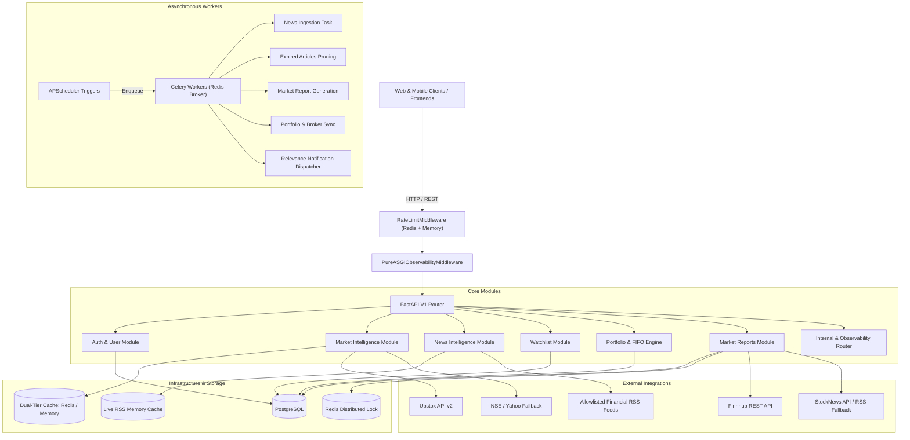

# SentiNews Backend — Production Readiness & API Inventory

**Version:** 1.0.0-PROD-AUDIT  
**Audit Phase:** Phase 1 — Full Module Map & Endpoint Inventory  
**Stack Context:** FastAPI, Hexagonal Architecture (Domain / Application / Infrastructure), PostgreSQL, Redis (Dual-tier Cache + Pub/Sub + Rate Limiting), APScheduler, Celery Workers, Prometheus/Loki APM, Broker Connectors (Zerodha Kite, Upstox).

---

## Executive Summary & Module Overview

The SentiNews backend is structured following hexagonal (ports and adapters) architecture principles with strict domain boundary isolation and SEBI statutory compliance rules (no actionable market advice, mandatory regulatory disclaimers, allowlisted RSS ingestion).

This inventory maps all **32 public, internal, and administrative endpoints**, their dependency graphs, execution complexity, logging instrumentation, metric coverage, and identified latency/concurrency bottlenecks.

---

## 1. Authentication & User Profile Module

- **Router Location:** [`app/api/v1/auth/router.py`](file:///c:/Users/Hp/Desktop/sentinews-backend/app/api/v1/auth/router.py)
- **Domain & Application:** [`app/modules/auth/application/use_cases/`](file:///c:/Users/Hp/Desktop/sentinews-backend/app/modules/auth/application/use_cases/)
- **Repository:** [`app/modules/auth/infrastructure/repositories/user_repository.py`](file:///c:/Users/Hp/Desktop/sentinews-backend/app/modules/auth/infrastructure/repositories/user_repository.py)
- **Database Model:** [`app/db/models/user.py`](file:///c:/Users/Hp/Desktop/sentinews-backend/app/db/models/user.py) (`users` table)

| Endpoint | Method | Auth | Rate Limit | Avg Complexity | Current Logging? | Current Metrics? | Dependency Chain & Notes |
| :--- | :---: | :---: | :---: | :---: | :---: | :---: | :--- |
| `/api/v1/auth/register` | `POST` | None | `auth` (5/min) | Medium (~40-80ms) | ASGI Middleware JSON log | `http_requests_total`, `http_request_duration_seconds`, rate limit counters | **DB:** `get_by_email` on `users` (`ix_users_email`), `create` insert. **Compute:** Password hashing (CPU-bound bcrypt/pbkdf2). **Bottleneck:** Synchronous password hashing inside async event loop; should be dispatched to threadpool under high concurrency. |
| `/api/v1/auth/login` | `POST` | None | `auth` (5/min) | Medium (~35-70ms) | ASGI Middleware JSON log | `http_requests_total`, `http_request_duration_seconds` | **DB:** `get_by_email` lookup. **Compute:** Password verification (CPU-bound) + JWT HS256 encode. **Bottleneck:** Event loop blocking during heavy concurrent login spikes. |
| `/api/v1/auth/token` | `POST` | None (Form) | `auth` (5/min) | Medium (~35-70ms) | ASGI Middleware JSON log | `http_requests_total`, `http_request_duration_seconds` | OAuth2 password flow endpoint for Swagger UI and SDK clients. Identical backend execution to `/login`. |
| `/api/v1/auth/google/login` | `GET` | None | `oauth` (10/min) | Low (~2-5ms) | ASGI Middleware JSON log | `http_requests_total`, `http_request_duration_seconds` | **In-Memory:** Generates signed HMAC CSRF state parameter and Google OAuth consent URL. **I/O:** Zero DB / network I/O. Extremely fast. |
| `/api/v1/auth/google/callback` | `GET` | None | `oauth` (10/min) | High (~200-450ms) | ASGI Middleware JSON log | `http_requests_total`, `http_request_duration_seconds` | **External API:** Outbound HTTPS to `oauth2.googleapis.com/token` and `openidconnect.googleapis.com/v1/userinfo`. **DB:** `get_by_email` on `users` -> `create` or `update` on first login. **Bottleneck:** Two serial external HTTP round-trips to Google APIs; susceptible to external WAN jitter. |
| `/api/v1/auth/google/exchange` | `POST` | None | `oauth` (10/min) | High (~200-450ms) | ASGI Middleware JSON log | `http_requests_total`, `http_request_duration_seconds` | SPA & Mobile authorization code exchange. Identical outbound Google API dependency chain as `/callback`. |
| `/api/v1/auth/google` | `POST` | None | `oauth` (10/min) | Medium (~80-180ms) | ASGI Middleware JSON log | `http_requests_total`, `http_request_duration_seconds` | Google One-Tap ID Token login. Verifies ID token signature via Google public keys/tokeninfo -> DB user lookup/creation -> JWT issuance. |
| `/api/v1/auth/me` | `GET` | JWT Bearer | `default` (120/min) | Low (~8-20ms) | ASGI Middleware JSON log | `http_requests_total`, `http_request_duration_seconds` | **DB:** Single-row SELECT on `users` by primary key `id` (`ix_users_id`). **Bottleneck:** Hit by every frontend page load. Repeated DB query on every authenticated request; prime candidate for short-lived Redis session cache (TTL 60s). |

---

## 2. Market Intelligence & Live Market Pulse Module

- **Router Location:** [`app/api/v1/endpoints/market.py`](file:///c:/Users/Hp/Desktop/sentinews-backend/app/api/v1/endpoints/market.py)
- **Application Service:** [`app/modules/market_intelligence/application/service.py`](file:///c:/Users/Hp/Desktop/sentinews-backend/app/modules/market_intelligence/application/service.py)
- **Market Providers:** [`app/integrations/market/resilient_provider.py`](file:///c:/Users/Hp/Desktop/sentinews-backend/app/integrations/market/resilient_provider.py), [`indian_market_provider.py`](file:///c:/Users/Hp/Desktop/sentinews-backend/app/integrations/market/indian_market_provider.py), [`upstox_provider.py`](file:///c:/Users/Hp/Desktop/sentinews-backend/app/integrations/market/upstox_provider.py)
- **Cache Infrastructure:** [`app/cache/market_cache.py`](file:///c:/Users/Hp/Desktop/sentinews-backend/app/cache/market_cache.py) (Dual-Tier: Redis + In-Memory LRU)

| Endpoint | Method | Auth | Rate Limit | Avg Complexity | Current Logging? | Current Metrics? | Dependency Chain & Notes |
| :--- | :---: | :---: | :---: | :---: | :---: | :---: | :--- |
| `/api/v1/market/indices` | `GET` | None | `default` (120/min) | Cache Hit: O(1) (~1-4ms) Cache Miss: O(N) (~150-350ms) | ASGI Middleware, debug logs in provider | `http_requests_total`, `http_request_duration_seconds`, `upstream_request_duration_seconds` | **Cache:** Key `market:indices` (TTL 15s). **External API (on miss):** Concurrently queries 5 major Indian benchmark indices (^NSEI, ^BSESN, ^NSEBANK, ^CNXIT, NIFTY_MIDCAP_100.NS) via `UpstoxMarketProvider` or `IndianMarketProvider`. **Resilience:** Latency hedged via `ResilientMarketProvider` with 2.0s fallback trigger. |
| `/api/v1/market/overview` | `GET` | None | `default` (120/min) | Cache Hit: O(1) (~1-5ms) Cache Miss: High (~400-850ms) | ASGI Middleware JSON log | `http_requests_total`, `http_request_duration_seconds`, `upstream_request_duration_seconds` | **Cache:** Key `market:overview` (TTL 30s). **External API (on miss):** Multi-stage fetch: 1) Major indices, 2) Live NSE variations API for top gainers/losers, 3) 50 constituent stocks for volume leaders. **Bottleneck:** Complex multi-call external dependency on cache miss. 30s cache TTL prevents vendor overload, but miss latency is high. |
| `/api/v1/market/quote/{symbol}` | `GET` | None | `default` (120/min) | Cache Hit: O(1) (~1-3ms) Cache Miss: Medium (~120-280ms) | ASGI Middleware JSON log | `http_requests_total`, `http_request_duration_seconds`, `upstream_request_duration_seconds` | **Cache:** Key `quote:{SYMBOL}` (TTL 15s; negative cache 60s for invalid symbols). **External API:** Upstox Intraday 1-min Candle / V2 Quote API with fallback to Yahoo chart endpoint. **Concurrency:** Governed by provider semaphore (`asyncio.Semaphore(20)`). |
| `/api/v1/market/quotes` | `GET` | None | `default` (120/min) | Cache Hit: O(K) (~3-8ms) Cache Miss: High (~200-500ms) | ASGI Middleware JSON log | `http_requests_total`, `http_request_duration_seconds`, `upstream_request_duration_seconds` | **Cache:** Multi-key lookup via `asyncio.gather` on `quote:{SYM}`. **External API:** Batch query to Upstox API for mapped symbols, concurrent fallback for remaining. **Bottleneck:** Unbounded symbol list in query param could cause request explosion; protected by concurrency semaphores. |
| `/api/v1/market/history/{symbol}` | `GET` | None | `default` (120/min) | Cache Hit: O(1) (~2-5ms) Cache Miss: Medium (~180-400ms) | ASGI Middleware JSON log | `http_requests_total`, `http_request_duration_seconds`, `upstream_request_duration_seconds` | **Cache:** Key `history:{SYMBOL}:{interval}:{range}` (TTL 120s). **External API:** Upstox historical candle endpoint or Yahoo chart API. **Compute:** Parses OHLCV candle arrays into typed domain models. |
| `/api/v1/market/search` | `GET` | None | `default` (120/min) | In-Memory: O(1) (~1-4ms) Remote: Medium (~120-250ms) | ASGI Middleware JSON log | `http_requests_total`, `http_request_duration_seconds` | **In-Memory:** Instant match against curated list of 50+ major Indian equities and indices. **External API (fallback):** Yahoo Finance search API for unmapped tickers. **Note:** 95%+ of typical user searches resolve in-memory with zero network I/O. |

---

## 3. News Intelligence Module (SEBI-Compliant RSS Pipeline)

- **Router Location:** [`app/api/v1/news/router.py`](file:///c:/Users/Hp/Desktop/sentinews-backend/app/api/v1/news/router.py)
- **Domain Services:** [`app/modules/news_intelligence/domain/services/`](file:///c:/Users/Hp/Desktop/sentinews-backend/app/modules/news_intelligence/domain/services/) (`live_news_service.py`, `clustering.py`, `financial_filter.py`, `article_tone.py`, `market_context.py`, `relevance.py`, `retention.py`)
- **Background Tasks:** [`workers/tasks/news_tasks.py`](file:///c:/Users/Hp/Desktop/sentinews-backend/workers/tasks/news_tasks.py) (`ingest_rss_news_task`, `cleanup_expired_articles_task`)
- **Database Model:** [`app/db/models/news.py`](file:///c:/Users/Hp/Desktop/sentinews-backend/app/db/models/news.py) (`news_articles` table)
- **Compliance Rules:** Mandatory SEBI disclaimer on every response; no actionable advice/signals; only public allowlisted RSS sources; full article scraping strictly prohibited.

| Endpoint | Method | Auth | Rate Limit | Avg Complexity | Current Logging? | Current Metrics? | Dependency Chain & Notes |
| :--- | :---: | :---: | :---: | :---: | :---: | :---: | :--- |
| `/api/v1/news/latest` | `GET` | None | `default` (120/min) | O(N) In-Memory (~6-20ms) | ASGI Middleware JSON log | `http_requests_total`, `http_request_duration_seconds`, `compute_duration_seconds["news_clustering"]` | **Service:** `LiveNewsService.get_latest_articles()` using stale-while-revalidate in-memory cache. **Filtering:** In-memory sector, symbol, and tone filters. **Ranking:** Smart sort score (epoch + click boost + 72h trending sticky weight). **Clustering:** Optional `cluster_articles()` pairwise title/embedding similarity. **Bottleneck:** If `clustered=True` is passed with large page limits, pairwise clustering compute is O(K^2). |
| `/api/v1/news/trending` | `GET` | None | `default` (120/min) | O(N) In-Memory (~5-15ms) | ASGI Middleware JSON log | `http_requests_total`, `http_request_duration_seconds` | **Service:** Filters articles where `is_trending == True` or `click_count > 0`, ordered by engagement clicks descending. **Retention:** Articles crossing 5 clicks remain boosted for 72 hours before natural retirement. |
| `/api/v1/news/sources` | `GET` | None | `default` (120/min) | O(1) (<2ms) | ASGI Middleware JSON log | `http_requests_total`, `http_request_duration_seconds` | Returns verified list of allowlisted SEBI-compliant RSS feeds (Moneycontrol, LiveMint, Economic Times, Yahoo Finance, Business Standard). |
| `/api/v1/news/{id}/full-coverage` | `GET` | None | `default` (120/min) | O(K^2) In-Memory (~15-35ms) | ASGI Middleware JSON log | `http_requests_total`, `http_request_duration_seconds`, `compute_duration_seconds["news_clustering"]` | **Service:** Fetches target article + candidate active articles -> Computes semantic & lexical Jaccard clusters -> Groups multi-publisher coverage of the same event with related publisher links. |
| `/api/v1/news/{id}/click` | `POST` | None | `news_click` (60/min) | O(1) In-Memory (~2-5ms) | ASGI Middleware, `logger.info("Article ID %d clicked...")` | `http_requests_total`, `http_request_duration_seconds`, `rate_limit_rejections_total` | **Engagement Tracking:** Increments atomic in-memory click counter. If threshold (5 clicks) is crossed, triggers `is_trending = True`, registers 72h sticky timestamp, and extends expiry. **Production Gap:** Clicks are currently stored in-memory per-process. In multi-pod container deployments, click increments must be synced to Redis / Postgres. |

---

## 4. Watchlist Module

- **Router Location:** [`app/api/v1/watchlist/router.py`](file:///c:/Users/Hp/Desktop/sentinews-backend/app/api/v1/watchlist/router.py)
- **Application Layer:** [`app/modules/watchlist/application/use_cases/`](file:///c:/Users/Hp/Desktop/sentinews-backend/app/modules/watchlist/application/use_cases/)
- **Repository:** [`app/modules/watchlist/infrastructure/repositories/watchlist_repository.py`](file:///c:/Users/Hp/Desktop/sentinews-backend/app/modules/watchlist/infrastructure/repositories/watchlist_repository.py)
- **Database Models:** [`app/db/models/watchlist.py`](file:///c:/Users/Hp/Desktop/sentinews-backend/app/db/models/watchlist.py) (`watchlists`, `watchlist_items` tables)

| Endpoint | Method | Auth | Rate Limit | Avg Complexity | Current Logging? | Current Metrics? | Dependency Chain & Notes |
| :--- | :---: | :---: | :---: | :---: | :---: | :---: | :--- |
| `/api/v1/watchlists` | `GET` | JWT Bearer | `default` (120/min) | Low (~12-30ms) | ASGI Middleware JSON log | `http_requests_total`, `http_request_duration_seconds`, `db_query_duration_seconds` | **DB:** Queries `watchlists` table for `user_id` with `selectinload(Watchlist.items)` ordered by `created_at`. **Optimization:** `selectinload` prevents N+1 by issuing 2 optimized queries regardless of watchlist count. Index `ix_watchlists_user_id_created_at` in place. |
| `/api/v1/watchlists` | `POST` | JWT Bearer | `default` (120/min) | Low (~15-35ms) | ASGI Middleware JSON log | `http_requests_total`, `http_request_duration_seconds` | **DB:** Inserts new row in `watchlists`. **Concurrency:** Protected against duplicate names via unique constraint `uq_watchlist_user_name` inside a nested transaction savepoint (`begin_nested()`). |
| `/api/v1/watchlists/user/{user_id}` | `GET` | JWT Bearer | `default` (120/min) | Low (~10-25ms) | ASGI Middleware JSON log | `http_requests_total`, `http_request_duration_seconds`, `db_query_duration_seconds` | **DB:** Executes `get_user_watchlists_summary` with `COUNT(watchlist_items.id)` and `GROUP BY` without loading individual stock items. Highly optimized summary query. |
| `/api/v1/watchlists/{watchlist_id}` | `GET` | JWT Bearer | `default` (120/min) | Low (~10-25ms) | ASGI Middleware JSON log | `http_requests_total`, `http_request_duration_seconds` | **DB:** Queries single watchlist by PK with `selectinload(items)`. Ownership verified in application layer. |
| `/api/v1/watchlists/{watchlist_id}/stocks` | `GET` | JWT Bearer | `default` (120/min) | Low (~10-25ms) | ASGI Middleware JSON log | `http_requests_total`, `http_request_duration_seconds` | Returns stock list for a specific watchlist. Same query path as `GET /{watchlist_id}`. |
| `/api/v1/watchlists/{watchlist_id}` | `PATCH` | JWT Bearer | `default` (120/min) | Low (~15-30ms) | ASGI Middleware JSON log | `http_requests_total`, `http_request_duration_seconds` | **DB:** Updates watchlist name and `updated_at`. Protected by unique constraint `uq_watchlist_user_name`. |
| `/api/v1/watchlists/{watchlist_id}` | `PUT` | JWT Bearer | `default` (120/min) | Low (~15-30ms) | ASGI Middleware JSON log | `http_requests_total`, `http_request_duration_seconds` | Alias delegating to PATCH handler. |
| `/api/v1/watchlists/{watchlist_id}` | `DELETE` | JWT Bearer | `default` (120/min) | Low (~15-30ms) | ASGI Middleware JSON log | `http_requests_total`, `http_request_duration_seconds` | **DB:** Deletes watchlist row. Cascades to `watchlist_items` via database foreign key `ON DELETE CASCADE`. |
| `/api/v1/watchlists/{watchlist_id}/stocks` | `POST` | JWT Bearer | `default` (120/min) | Low (~15-35ms) | ASGI Middleware JSON log | `http_requests_total`, `http_request_duration_seconds` | **DB:** Inserts into `watchlist_items`. **Concurrency:** Protected against duplicate symbols in the same watchlist via `uq_watchlist_symbol` and nested transaction. |
| `/api/v1/watchlists/{watchlist_id}/stocks/{symbol_or_id}` | `DELETE` | JWT Bearer | `default` (120/min) | Low (~15-30ms) | ASGI Middleware JSON log | `http_requests_total`, `http_request_duration_seconds` | **DB:** Deletes stock item matching either ticker symbol (e.g. `TCS`) or integer item ID. |

---

## 5. Portfolio & Valuation Module (FIFO & Performance Engine)

- **Router Location:** [`app/api/v1/portfolio/router.py`](file:///c:/Users/Hp/Desktop/sentinews-backend/app/api/v1/portfolio/router.py)
- **Domain Services:** [`app/modules/portfolio/domain/services/`](file:///c:/Users/Hp/Desktop/sentinews-backend/app/modules/portfolio/domain/services/) (`cost_basis.py`, `performance.py`)
- **Application Layer:** [`app/modules/portfolio/application/use_cases/`](file:///c:/Users/Hp/Desktop/sentinews-backend/app/modules/portfolio/application/use_cases/)
- **Repository:** [`app/modules/portfolio/infrastructure/repositories/portfolio_repository.py`](file:///c:/Users/Hp/Desktop/sentinews-backend/app/modules/portfolio/infrastructure/repositories/portfolio_repository.py)
- **Database Models:** [`app/db/models/portfolio.py`](file:///c:/Users/Hp/Desktop/sentinews-backend/app/db/models/portfolio.py) (`portfolios`, `holdings`, `transactions` tables)
- **Broker Connectors:** [`app/modules/portfolio/infrastructure/broker_connectors/`](file:///c:/Users/Hp/Desktop/sentinews-backend/app/modules/portfolio/infrastructure/broker_connectors/) (`kite.py`, `upstox.py`)

| Endpoint | Method | Auth | Rate Limit | Avg Complexity | Current Logging? | Current Metrics? | Dependency Chain & Notes |
| :--- | :---: | :---: | :---: | :---: | :---: | :---: | :--- |
| `/api/v1/portfolio` | `POST` | JWT Bearer | `default` (120/min) | Low (~15-30ms) | ASGI Middleware JSON log | `http_requests_total`, `http_request_duration_seconds` | **DB:** Inserts new portfolio record linked to `user_id`. |
| `/api/v1/portfolio/{id}` | `GET` | JWT Bearer | `default` (120/min) | Low (~15-30ms) | ASGI Middleware JSON log | `http_requests_total`, `http_request_duration_seconds` | **DB:** Loads portfolio by ID with `selectinload(holdings)` and `selectinload(transactions)`. **Note:** Eagerly loads all holdings & transactions even when only portfolio header is returned. |
| `/api/v1/portfolio/user/{user_id}` | `GET` | JWT Bearer | `default` (120/min) | Low (~15-35ms) | ASGI Middleware JSON log | `http_requests_total`, `http_request_duration_seconds` | **DB:** Retrieves user's primary portfolio. Auto-creates a default portfolio if first-time access. |
| `/api/v1/portfolio/{id}` | `DELETE` | JWT Bearer | `default` (120/min) | Low (~15-30ms) | ASGI Middleware JSON log | `http_requests_total`, `http_request_duration_seconds` | **DB:** Deletes portfolio. Cascades to `holdings` and `transactions` via DB foreign key. |
| `/api/v1/portfolio/{id}/transactions` | `POST` | JWT Bearer | `default` (120/min) | Medium (~35-70ms) | ASGI Middleware JSON log | `http_requests_total`, `compute_duration_seconds["fifo_cost_basis_symbol"]` | **DB:** Inserts transaction into `transactions` -> Reloads full portfolio -> Calculates FIFO cost basis -> Upserts holding in `holdings` -> Recalculates weights. **Async Offloading:** Offloads compute to threadpool. |
| `/api/v1/portfolio/{id}/transactions` | `GET` | JWT Bearer | `default` (120/min) | Low (~15-30ms) | ASGI Middleware JSON log | `http_requests_total`, `http_request_duration_seconds` | **DB:** Queries `transactions` table ordered by `timestamp.desc()`. **Bottleneck:** Slices pagination in-memory (`txs[offset:offset+limit]`) instead of SQL `LIMIT`/`OFFSET`. For portfolios with thousands of trades, this becomes wasteful. |
| `/api/v1/portfolio/{id}/holdings` | `GET` | JWT Bearer | `default` (120/min) | Medium (~30-65ms) | ASGI Middleware JSON log | `http_requests_total`, `compute_duration_seconds["portfolio_weights"]` | **DB:** Loads holdings. **Market Data:** Batch queries current prices. **Compute:** Recalculates live weights, market value, unrealized P&L. |
| `/api/v1/portfolio/{id}/overview` | `GET` | JWT Bearer | `heavy_compute` (20/min) | Medium (~40-90ms) | ASGI Middleware JSON log | `http_requests_total`, `compute_duration_seconds["portfolio_weights"]`, `compute_duration_seconds["fifo_cost_basis_portfolio"]` | **DB:** Loads portfolio with holdings & transactions. **Market Data:** Batch queries quotes from cache / provider. **Compute:** Offloaded to threadpool: 1) FIFO cost bases for all symbols (realized P&L), 2) Dynamic market value & weights, 3) Unrealized P&L aggregations. |
| `/api/v1/portfolio/{id}/allocation` | `GET` | JWT Bearer | `default` (120/min) | Low (~15-35ms) | ASGI Middleware JSON log | `http_requests_total`, `compute_duration_seconds["portfolio_weights"]` | **DB:** Retrieves holdings with weights -> Computes holding weight breakdown and sector concentration percentages. |
| `/api/v1/portfolio/{id}/performance` | `GET` | JWT Bearer | `heavy_compute` (20/min) | Medium-High (~45-120ms) | ASGI Middleware JSON log | `http_requests_total`, `compute_duration_seconds["portfolio_xirr"]` | **DB:** Loads transactions & holdings. **Compute:** 1) FIFO cost basis, 2) Builds cash flow stream from BUYs, SELLs, and current terminal value, 3) Runs Newton-Raphson XIRR optimization (`asyncio.to_thread(calculate_xirr)`), 4) Identifies top gainer and loser holdings. |
| `/api/v1/portfolio/{id}/news-feed` | `GET` | JWT Bearer | `default` (120/min) | High (~60-150ms) | ASGI Middleware JSON log | `http_requests_total`, `compute_duration_seconds["news_clustering"]`, `compute_duration_seconds["news_relevance"]` | **Integration:** 1) Loads portfolio holdings via `PortfolioHoldingsReaderAdapter`, 2) Queries candidate news articles matching symbols & sectors in a single batch, 3) Runs Full Coverage clustering, 4) Calculates relevance score (semantic similarity + weight % + recency decay + tone magnitude), 5) Enqueues high-relevance Celery alerts if score >= 0.70 & weight >= 15%, 6) Returns ranked feed with SEBI disclaimer. |

---

## 6. Market Reports Module (Domestic & Global Pre/Post Market)

- **Router Location:** [`app/api/v1/market_reports/router.py`](file:///c:/Users/Hp/Desktop/sentinews-backend/app/api/v1/market_reports/router.py)
- **Internal Admin Router:** Mounted at `/internal/market-reports/generate`
- **Application Layer:** [`app/modules/market_reports/application/`](file:///c:/Users/Hp/Desktop/sentinews-backend/app/modules/market_reports/application/) (`queries.py`, `use_cases/`)
- **Repository:** [`app/modules/market_reports/infrastructure/repositories/market_report_repository.py`](file:///c:/Users/Hp/Desktop/sentinews-backend/app/modules/market_reports/infrastructure/repositories/market_report_repository.py)
- **Database Model:** [`app/db/models/market_report.py`](file:///c:/Users/Hp/Desktop/sentinews-backend/app/db/models/market_report.py) (`market_reports` table)
- **Scheduler & Workers:** [`app/modules/market_reports/infrastructure/scheduler.py`](file:///c:/Users/Hp/Desktop/sentinews-backend/app/modules/market_reports/infrastructure/scheduler.py) (APScheduler cron), [`workers/tasks/market_report_tasks.py`](file:///c:/Users/Hp/Desktop/sentinews-backend/workers/tasks/market_report_tasks.py) (Celery)

| Endpoint | Method | Auth | Rate Limit | Avg Complexity | Current Logging? | Current Metrics? | Dependency Chain & Notes |
| :--- | :---: | :---: | :---: | :---: | :---: | :---: | :--- |
| `/api/v1/market-reports/pre-market/latest` | `GET` | JWT Bearer | `default` (120/min) | Low (~10-25ms) | ASGI Middleware JSON log | `http_requests_total`, `http_request_duration_seconds` | **DB:** Queries `market_reports` by `report_type='PRE_MARKET'` and `status='PUBLISHED'` ordered by `report_date.desc()`. Fast indexed query (`ix_market_reports_type_status_date`). **Caching Opportunity:** High morning read traffic; can be cached in Redis with 5-min TTL. |
| `/api/v1/market-reports/post-market/latest` | `GET` | JWT Bearer | `default` (120/min) | Low (~10-25ms) | ASGI Middleware JSON log | `http_requests_total`, `http_request_duration_seconds` | **DB:** Queries latest published domestic post-market report. Fast indexed read. |
| `/api/v1/market-reports/global/pre-market/latest` | `GET` | JWT Bearer | `default` (120/min) | Low (~10-25ms) | ASGI Middleware JSON log | `http_requests_total`, `http_request_duration_seconds` | **DB:** Queries latest published global pre-market report (Wall Street close, Asian markets, GIFT Nifty, Macro). |
| `/api/v1/market-reports/global/post-market/latest` | `GET` | JWT Bearer | `default` (120/min) | Low (~10-25ms) | ASGI Middleware JSON log | `http_requests_total`, `http_request_duration_seconds` | **DB:** Queries latest published global post-market report (European close, US mid-session, Commodities, FX). |
| `/api/v1/market-reports/{report_id}` | `GET` | JWT Bearer | `default` (120/min) | Low (~10-20ms) | ASGI Middleware JSON log | `http_requests_total`, `http_request_duration_seconds` | **DB:** Single-row lookup on `market_reports` by primary key `id`. |
| `/api/v1/market-reports` | `GET` | JWT Bearer | `default` (120/min) | Low-Medium (~15-35ms) | ASGI Middleware JSON log | `http_requests_total`, `http_request_duration_seconds` | **DB:** Paginated query with optional `report_type`, `start_date`, `end_date` filters. Runs count query + paginated slice query. |
| `/internal/market-reports/generate` | `POST` | Admin / Internal (`X-Internal-Token` or Superuser) | Excluded | High (~1.5s - 4.5s) | ASGI Middleware, task logger | `http_requests_total`, `job_duration_seconds`, `upstream_request_duration_seconds` | **Lock:** Distributed Redis lock (`RedisReportLock`) prevents duplicate runs. **Calendar:** Checks `NSETradingCalendar` for trading holidays. **External API:** Finnhub (global indices, commodities, economic calendar) + StockNews / RSS. **Compliance:** Enforces SEBI neutral language framing. **DB:** Saves report with `status=PUBLISHED`. |

---

## 7. Health, Readiness, Metrics & Observability Probes

- **Router Locations:** [`app/main.py`](file:///c:/Users/Hp/Desktop/sentinews-backend/app/main.py), [`app/api/v1/endpoints/health.py`](file:///c:/Users/Hp/Desktop/sentinews-backend/app/api/v1/endpoints/health.py), [`app/infrastructure/observability/internal_router.py`](file:///c:/Users/Hp/Desktop/sentinews-backend/app/infrastructure/observability/internal_router.py), [`chaos_router.py`](file:///c:/Users/Hp/Desktop/sentinews-backend/app/infrastructure/observability/chaos_router.py)

| Endpoint | Method | Auth | Rate Limit | Avg Complexity | Current Logging? | Current Metrics? | Dependency Chain & Notes |
| :--- | :---: | :---: | :---: | :---: | :---: | :---: | :--- |
| `/health` | `GET` | None | Excluded | O(1) (<1ms) | Excluded from RED logging | Excluded | Root liveness probe returning application title, status, and environment. Excluded from Prometheus metrics to avoid skewing golden signals. |
| `/api/v1/health` | `GET` | None | Excluded | O(1) (~1-3ms) | Excluded from RED logging | Excluded | Application health check returning uptime, active market provider, and Redis/In-memory cache connectivity status. |
| `/healthz` | `GET` | None | Excluded | O(1) (<1ms) | Excluded from RED logging | Excluded | Kubernetes / container runtime liveness probe. |
| `/readyz` | `GET` | None | Excluded | Low (~2-8ms) | Excluded from RED logging | Excluded | **Deep Readiness Probe:** Executes asynchronous `SELECT 1` on PostgreSQL pool and `ping()` on Redis within a 1.5s timeout. Returns 200 if healthy, 503 Service Unavailable if dependencies are down. |
| `/internal/metrics` | `GET` | `METRICS_TOKEN` (Bearer) | Excluded | O(M) (~5-15ms) | Excluded from RED logging | Excluded | **Prometheus Exposition:** Secured scrape endpoint returning all registered RED metrics, DB pool gauges, compute timers, system resource stats, and crash signature counters in OpenMetrics text format. |
| `/internal/crash-signatures` | `GET` | `METRICS_TOKEN` (Bearer) | Excluded | O(1) (<2ms) | Excluded from RED logging | Excluded | Returns in-memory ring buffer of the last 200 crash signatures with occurrence counts, locations, and stack traces. |
| `/internal/chaos/*` (6 endpoints) | `POST` | Disabled in Production (403) | Excluded | Controlled Fault | ASGI Middleware JSON log | `http_unhandled_exceptions_total`, `crash_signature_total` | Fault injection endpoints (`cpu-burn`, `memory-leak`, `db-pool-exhaust`, `sleep`, `unhandled-exception`, `upstream-timeout`) for testing APM alerts and auto-recovery. |

---

## 8. WebSocket, Realtime & Broker Background Infrastructure

| Component / Task | Trigger / Transport | Auth | Schedule / Event | Current Observability | Dependencies & Bottleneck Analysis |
| :--- | :--- | :--- | :--- | :--- | :--- |
| **WebSocket Fanout Handler** | Pure ASGI (`scope["type"] == "websocket"`) | Handshake Token | Live Connection Lifecycle | Gauge `ws_connections_active` | **Pub/Sub:** Listens to Redis pub/sub channel for market ticks and broadcasts to active client websockets. **Bottleneck:** Redundant per-client JSON serialization under high connection counts; broadcast must serialize once and fan out bytes. |
| **Celery: `ingest_rss_news_task`** | Celery Beat | Internal Worker | Every 10 minutes | Task start/success/failure logs in Celery logger | **External API / Network:** Fetches allowlisted RSS feeds concurrently (`RSSFeedFetcher`). **Compute:** Extracts symbols/sectors, classifies tone. **DB:** Batch inserts non-duplicate articles into `news_articles`. |
| **Celery: `cleanup_expired_articles_task`** | Celery Beat | Internal Worker | Every 24 hours | Task start/success logs | **DB:** Executes `DELETE FROM news_articles WHERE is_trending = FALSE AND expires_at <= NOW()`. Cleans up non-trending stale articles older than 24h. |
| **Celery: `generate_market_report_task`** | APScheduler / Internal POST | Internal Worker | Mon-Fri 07:00, 07:45, 16:00, 20:00 IST | Task logger, `job_duration_seconds` | **Lock:** Distributed Redis lock. **Calendar:** NSE trading calendar holiday check. **External APIs:** Finnhub + StockNews. **DB:** Persists published market reports. |
| **Celery: `sync_portfolio_holdings`** | Event-driven (User sync) | Internal Worker | On-demand / scheduled | Task logger | **External API:** Broker SDKs (Zerodha Kite / Upstox) -> Fetches broker holdings -> Recalculates FIFO cost basis and portfolio weights -> Updates DB. |
| **Celery: `send_relevance_alert_notification`** | Event-driven (High Relevance News) | Internal Worker | On-demand when score >= 0.70 & weight >= 15% | Task logger | Enqueues push/email/websocket notification to user for concentrated portfolio holdings. |
| **APScheduler Enqueuer** | In-Process Cron Engine | In-App Scheduler | Mon-Fri Trading Schedule | Logger `sentinews.market_reports.scheduler` | **Strictly Enqueue-Only:** Does not execute heavy I/O in-process; enqueues tasks onto Celery Redis work queue. |

---

## 9. Comprehensive Latency & Slow Path Findings

### Identified Latency Hotspots & Optimization Opportunities

1. **Repeated DB User Query in Auth Dependency (`get_current_user`):**
   - *Issue:* Every authenticated endpoint (`/portfolio/*`, `/watchlists/*`, `/market-reports/*`) invokes `get_current_user`, issuing a single-row SQL `SELECT` on `users` table on every single request.
   - *Impact:* High DB query volume on Postgres connection pool during traffic bursts.
   - *Recommended Fix (Phase 2):* Cache user identity in Redis with 60s TTL or cache decoded token payload in memory.

2. **In-Memory Transaction Pagination in Portfolio (`GET /portfolio/{id}/transactions`):**
   - *Issue:* Queries all historical transactions from PostgreSQL (`get_transactions`), loading all rows into Python memory before applying slice `[offset : offset + limit]`.
   - *Impact:* For active portfolios with hundreds/thousands of trades, incurs heavy memory and query overhead.
   - *Recommended Fix (Phase 2):* Implement SQL-level `LIMIT` and `OFFSET` in `SQLAlchemyPortfolioRepository.get_transactions()`.

3. **Eager Loading in Single Portfolio Query (`GET /portfolio/{id}`):**
   - *Issue:* `get_portfolio(portfolio_id)` uses `selectinload` for both `holdings` and `transactions`, executing 3 queries even when only basic portfolio metadata (name, cash balance) is needed.
   - *Impact:* Extra database round-trips.
   - *Recommended Fix (Phase 2):* Provide a lightweight `get_portfolio_metadata()` method for metadata-only endpoints.

4. **Market Overview Multi-Vendor Aggregation Latency (`GET /market/overview`):**
   - *Issue:* On cache miss (every 30s), fires NSE cookie handshake + 2 NSE API calls + constituent stock quotes sequentially/concurrently.
   - *Impact:* Cache miss p95 can reach 800ms+.
   - *Recommended Fix (Phase 2):* Warm the cache in the background via Celery Beat or background task so user requests always hit a warm Redis key with ~2ms latency.

5. **Market Reports Latest Query Caching (`GET /market-reports/*/latest`):**
   - *Issue:* Peak read traffic occurs at market open (08:00–09:15 IST) where thousands of users request the latest pre-market report simultaneously.
   - *Impact:* Hundreds of identical SQL queries on `market_reports` table.
   - *Recommended Fix (Phase 2):* Cache the latest published report in Redis with a 5-minute TTL.

6. **Password Hashing Event Loop Blocking in Auth (`/register`, `/login`):**
   - *Issue:* Password hashing with `bcrypt` / `passlib` is synchronous and CPU-heavy (50-100ms CPU time).
   - *Impact:* Multiple concurrent login attempts will starve the single-threaded asyncio event loop.
   - *Recommended Fix (Phase 2):* Offload `verify_password()` and `hash_password()` to threadpool using `asyncio.to_thread()`.

7. **News Engagement Click Synchronization:**
   - *Issue:* Clicks are tracked in `LiveNewsService._clicks` in-process dictionary.
   - *Impact:* In a multi-worker / multi-container deployment, click counts and 72h trending flags are not shared across worker processes.
   - *Recommended Fix (Phase 2):* Use Redis atomic `HINCRBY` / `ZINCRBY` for distributed engagement counters.

---

## 10. Observability & Instrumentation Coverage Summary

| Module | Endpoints Count | Structured Logging? | RED Prometheus Metrics? | Custom Business Metrics? | Distributed Tracing? |
| :--- | :---: | :---: | :---: | :---: | :---: |
| **Auth** | 8 | Yes (ASGI JSON) | Yes (Requests, Duration, Errors) | Partial (Rate limit rejections) | Yes (Request ID propagated) |
| **Market Intelligence** | 6 | Yes (ASGI JSON) | Yes (Requests, Duration) | Yes (`upstream_request_duration_seconds`, provider outcome) | Yes (HTTP client instrumented) |
| **News Intelligence** | 5 | Yes (ASGI JSON) | Yes (Requests, Duration) | Yes (`compute_duration_seconds["news_clustering"]`, tone/relevance) | Yes |
| **Watchlist** | 10 | Yes (ASGI JSON) | Yes (Requests, Duration) | Yes (`db_query_duration_seconds`) | Yes (SQL alchemy engine traced) |
| **Portfolio & Returns** | 11 | Yes (ASGI JSON) | Yes (Requests, Duration) | Yes (`compute_duration_seconds["portfolio_xirr"]`, `fifo_cost_basis`) | Yes |
| **Market Reports** | 7 | Yes (ASGI JSON) | Yes (Requests, Duration) | Yes (`job_duration_seconds`, report type tags) | Yes |
| **Health / Probes** | 6 | Excluded from RED | Yes (DB pool gauges, Redis ping) | Yes (System memory, CPU, open FDs, event loop lag) | N/A |
| **Background Tasks** | 5 tasks | Yes (Celery Logger) | Yes (Task duration / failure counters) | Partial (Need queue depth gauge export) | Celery task ID tracking |

---

## 11. Next Steps — Transition to Phase 2

1. Review and validate this inventory and slow-path findings.
2. Proceed to **Phase 2 (Latency Audit & Optimization)** to implement:
   - Database query optimizations (SQL-level pagination on transactions, lightweight portfolio lookup).
   - Redis caching for latest market reports (5-min TTL) and user auth session cache (60s TTL).
   - Offloading CPU-heavy crypto operations (`bcrypt`) to `asyncio.to_thread`.
   - Distributed Redis click counters for multi-worker news trending sticky policy.
3. Proceed to **Phase 3 (Observability & Structured Logging Hardening)**.
4. Proceed to **Phase 4 (Prometheus Metrics & Business Gauges)**.
5. Proceed to **Phase 5 (Grafana Master Dashboard & Alerting Rules)**.
